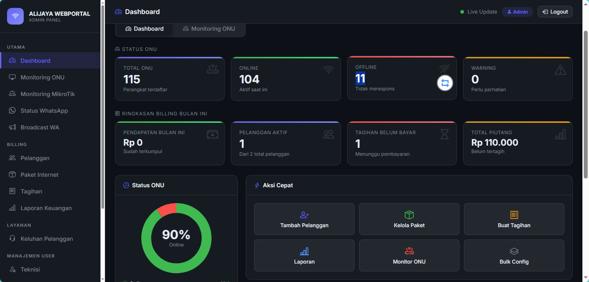

# RTRWNET Management & Billing System



Sistem manajemen ISP yang mengintegrasikan **penagihan**, **GenieACS**, **OLT (SNMP)**, **MikroTik** (PPPoE/hotspot/voucher), **peta jaringan (GIS)**, **inventaris**, **WhatsApp/Telegram**, dan **multi-portal** (admin, teknisi, pelanggan, agen) dalam satu platform.

[](https://github.com/anwar-BK/billing-V2.0/blob/master/LICENSE)
[](https://github.com/anwar-BK/billing-V2.0/stargazers)
[](https://nodejs.org/)

---

## Daftar fitur (sesuai modul di aplikasi)

### Peta jaringan & geografis
- **Koordinat kantor / pusat peta**: `office_lat` dan `office_lng` di `settings.json` menjadi titik acuan peta.
- **Peta admin** (`/admin/map`): **Leaflet** dengan basemap **OpenStreetMap** dan **satelit (hybrid)**; marker **pelanggan** dan **ODP**; garis hubung pelanggan–ODP; penyimpanan **jalur kabel** (polyline) per pelanggan; popup detail, status paket, dan **grafik/trafik PPPoE** (real-time dari MikroTik saat online).
- **Peta teknisi** (`/tech/map`): tampilan geografis pelanggan & ODP, garis ke ODP, popup dengan **chat WhatsApp** dan **buka rute di Google Maps**; opsi **lokasi GPS** perangkat teknisi di peta.
- **Pemilih lokasi di form pelanggan**: dialog peta (satelit) untuk mengisi **latitude/longitude** saat tambah/edit data pelanggan.

### Billing, tagihan & pembayaran
- **Promo & prorata (per paket)**: harga promo untuk **N siklus tagihan pertama** per pelanggan (`promo_price` + `promo_cycles` di paket; counter `promo_cycles_used` di pelanggan, di-reset saat **ganti paket**). **Prorata** untuk **invoice pertama** bila tanggal pasang (`install_date`) jatuh di **bulan yang sama** dengan periode tagihan dan opsi prorata diaktifkan di paket (proporsi sisa hari dalam bulan). Rincian ditulis di kolom catatan invoice (`AUTO: …`).
- **Admin — alat billing**: **Reset siklus promo** (tombol di daftar pelanggan, hanya admin) mengembalikan `promo_cycles_used` ke 0. **Susulan prorata bulan pasang** membuat satu invoice untuk **bulan kalender tanggal pasang** jika belum ada, dengan nominal prorata dari **harga reguler** (bukan promo), untuk menutup kasus tagihan bulan pasang yang terlewat.
- Generate tagihan **per pelanggan** atau **massal**; status lunas/belum bayar; cetak invoice; batalkan pembayaran (unpay) jika diperlukan.
- **Bayar tunggal / bayar massal** dari panel admin; integrasi pembayaran online: **Midtrans**, **Tripay**, **Xendit**, **Duitku** (aktif/nonaktif lewat `settings.json`).
- **Notifikasi WhatsApp pelanggan saat tagihan dibayar**: otomatis terkirim ketika invoice ditandai lunas melalui **agent**, **admin**, **kasir**, atau **approval kolektor** (jika fitur WhatsApp diaktifkan).
- **QRIS / nominal unik**: penugasan & pembersihan kode unik invoice; cocokkan pembayaran dari notifikasi.
- **Webhook pembayaran generik**: endpoint `POST /api/webhook/v1/payment-notif` (dengan `MY_WEBHOOK_SECRET` di `.env`) untuk mencatat notifikasi teks bank/e-wallet dan **otomatis menandai lunas** jika nominal cocok dengan tagihan unik; log tampilan & pembersihan di admin.
- Callback/redirect pembayaran dari portal pelanggan; halaman **isolir** statis `/isolated` (mis. untuk redirect dari MikroTik).

### MikroTik & jaringan
- **Multi-router**: daftar router MikroTik, tes koneksi, **setup firewall** bawaan, pemilihan router per pelanggan.
- Dukungan **RouterOS 7** (menggunakan client API yang kompatibel untuk menghindari error balasan `!empty` pada library lama).
- **PPPoE**: profil, user/secret, sesi aktif, **monitor trafik**; **jam kalong** (ganti profil malam/hari lewat cron); **FUP** (ganti profil saat pemakaian bulanan melewati batas paket).
- **Pencatatan pemakaian (usage)**: sinkron periodik dari counter sesi PPPoE ke database (dapat dimatikan lewat pengaturan `usage_tracking_enabled`).
- **Aktif sementara pelanggan**: buka isolir sampai tanggal yang ditentukan admin, termasuk pengingat WhatsApp sebelum masa aktif berakhir.
- **Hotspot**: profil user, user hotspot, sesi aktif hotspot.
- **Voucher hotspot**: template voucher, **batch** generate, sinkron ke MikroTik, cetak batch, export **CSV**, hapus batch.
- **Backup konfigurasi** MikroTik dari panel.

### GenieACS (TR-069 / perangkat pelanggan)
- Daftar perangkat, detail per **tag**; ubah **SSID** / **password Wi‑Fi**, **reboot** CPE; operasi **bulk SSID**.
- Integrasi ke data pelanggan (tag GenieACS) untuk monitoring dari admin/teknisi.

### OLT PON (SNMP)
- Manajemen **OLT** (host, community SNMP, port, merek, kredensial web/Telnet, opsional **port Telnet** & **password enable** ZTE, opsional **API Base URL** untuk delegasi ke [go-api-c320](https://github.com/s4lfanet/go-api-c320)).
- **Statistik ONU** per port; aksi **reboot ONU**, **rename**, **otorisasi ONU**, **konfigurasi WAN** (Telnet OMCI, TR069 GenieACS, atau **REST go-api** untuk ZTE: `POST /api/v1/vlan/onu` — bridge/VLAN; PPPoE tetap Telnet/TR069).

### ODP & infrastruktur pasif
- CRUD **ODP** (titik distribusi) dengan koordinat; ditampilkan di peta bersama pelanggan.

### Pelanggan & data
- CRUD pelanggan: paket, PPPoE, profil isolir, **hari isolir per pelanggan**, **isolir otomatis** per pelanggan, tag GenieACS, **tipe koneksi** / ODP / koordinat.
- **Isolir / buka isolir** manual dari admin (sinkron ke MikroTik).
- **Ekspor** daftar pelanggan; **impor** dari berkas (Excel) dengan upload.
- **Bulk tools** untuk operasi terhadap banyak peranggan/perangkat sekaligus.

### Paket layanan
- CRUD paket harga, kecepatan, deskripsi; opsi **jam kalong** (profil malam); opsi **FUP** (batas GB + profil turun kecepatan).

### Inventaris (gudang)
- Kategori & item; penyesuaian stok; peringatan stok rendah (sesuai implementasi di panel).

### Tiket dukungan
- Daftar tiket (admin); pelanggan dapat **membuat tiket** dari portal; teknisi **ambil tiket** dan **update** penanganan.

### Laporan & dashboard
- Laporan keuangan/agregasi di panel admin; dashboard ringkasan (sesuai halaman utama admin).

### Monitoring & kesehatan sistem
- Halaman **monitoring** (admin/teknisi): CPU, RAM, disk, konektivitas ke layanan terkait.
- API **`/health`** (publik ringan) dan API metrik/stats untuk panel.

### WhatsApp (Baileys)
- Status koneksi, **broadcast** massal dengan jeda/antrian, jeda/lanjut/stop broadcast.
- Pengaturan **pengingat tagihan otomatis** (template pesan + jadwal via cron).
- Tes notifikasi, reset sesi autentikasi bot; integrasi ke tagihan (kirim info invoice via WhatsApp).
- Perintah via WhatsApp:
  - **Admin**: menu admin, billing tools, Mikrotik tools, **cek saldo Digiflazz**, **beli pulsa Digiflazz**, **topup saldo agent**.
  - **Agent**: **beli pulsa Digiflazz** dan cek status transaksi.

### Telegram (opsional)
- Bot admin (aktifkan di `settings.json`); sinkronisasi dari panel bila tersedia.

### Manajemen pengguna internal
- **Super admin / admin / kasir**: sesi terpisah; pembatasan aksi sensitif untuk peran tertentu (`restrictToAdmin`).
- **Teknisi**: akun terpisah, area tugas.
- **Kasir**: akun untuk operasi kasir.
- **Kolektor**: akun untuk **cek tagihan pelanggan** (lunas/belum), buat **pengajuan pembayaran** yang menunggu approval admin/kasir.
- **Audit log**: riwayat aktivitas sensitif (super admin).

### Agen / mitra penjualan
- Portal agen: **bayar tagihan** pelanggan (uang saldo agen), **jual voucher**, **cetak struk** transaksi.
- Portal agen: **transaksi pulsa/produk digital Digiflazz** (UI kategori→brand→nominal, status update via webhook Digiflazz).
- Admin: kelola agen, **top-up saldo**, **harga khusus** per agen, laporan agen.
- Admin: dashboard Digiflazz (sync produk, cek transaksi, webhook).

### Portal pelanggan (self-service)
- Halaman informasi: **syarat & ketentuan**, **privasi**, **tentang**, **kontak**.
- **Cek tagihan** tanpa login (nomor/ID sesuai alur di aplikasi).
- **Registrasi** pelanggan baru (online); login; opsi **login OTP** bila diaktifkan di pengaturan.
- **Dashboard**: status layanan, tagihan, pembayaran; **grafik/trafik PPPoE** untuk akun sendiri.
- Ubah **SSID / password Wi‑Fi**, **reboot** CPE, ubah identitas/tag perangkat (sesuai kebijakan yang diaktifkan).
- **Beli voucher** (publik/halaman voucher) dengan alur pembayaran.
- Buat **tiket** keluhan ke provider.

### Portal teknisi
- Ringkasan tugas, **pool** tiket, **riwayat** penanganan.
- **Peta jaringan** (lihat bagian peta).
- **Monitoring** sistem.
- **Input pelanggan baru** dari lapangan (dengan bantuan API MikroTik & ODP/port).
- Akses ringkas ke **perangkat GenieACS** (detail, SSID, password, reboot) untuk pelanggan yang ditangani.

### Otomatisasi terjadwal (cron)
- Tanggal **1 jam 00:01**: generate **tagihan bulanan**.
- Setiap hari **jam 02:00**: **isolir otomatis** pelanggan aktif yang lewat jatuh tempo/isolir (sesuai hari & flag per pelanggan).
- **Jam 09:00**: pengingat tagihan via **WhatsApp** (jumlah hari sebelum isolir dapat diatur dari panel).
- **Jam 09:00**: pengingat pelanggan **aktif sementara** sebelum tanggal akses berakhir (jumlah hari dapat diatur dari panel).
- **00:00 & 06:00**: **jam kalong** — ganti profil PPPoE malam/siang untuk paket yang mengaktifkannya.
- Setiap **10 menit**: **sinkron pemakaian data** dari sesi **PPPoE aktif** di MikroTik (jika tracking diaktifkan).
- Setiap **jam**: pengecekan **FUP** dan penurunan profil bila kuota habis.

### Backup & pemeliharaan
- **Backup & restore** database dari panel admin; pembersihan file backup lama.
- **Jalur update** (halaman update + eksekusi skrip) untuk pemeliharaan server (sesuai implementasi `update.sh` / panel).

### Bahasa antarmuka (i18n)
- Pilihan bahasa lewat **query `?lang=`**, sesi, atau pintasan **`/lang/:lang`**; berkas teks di folder `locales/`.

---

## Ringkasan tech stack

- **Runtime**: Node.js **≥ 20** (disarankan LTS terbaru 20.x)
- **Backend**: Express.js
- **Database**: SQLite lewat **better-sqlite3** (file utama: `database/billing.db` — dibuat/dimigrasi otomatis saat pertama jalan)
- **Tampilan**: EJS, Bootstrap 5, Bootstrap Icons
- **Peta**: Leaflet + tile OpenStreetMap / satelit (Google hybrid) di panel admin & teknisi
- **Integrasi**: GenieACS REST API, MikroTik RouterOS API, SNMP (`net-snmp`) untuk OLT, Baileys (WhatsApp), bot Telegram (opsional), gateway pembayaran (sesuai konfigurasi), parsing spreadsheet (**xlsx**) untuk impor data

---

## Instalasi

# Billing + GenieACS (BK-NET)

Repository ini berisi sistem *billing* RT/RW Net yang terintegrasi langsung dengan **GenieACS** untuk manajemen perangkat ONT/Router secara otomatis menggunakan protokol TR-069, dirancang khusus untuk operasional ISP **BK-NET**.

## Panduan Cepat Ubuntu dari Nol

Bagian ini adalah urutan instalasi yang direkomendasikan untuk server Ubuntu baru.

### 1. Siapkan Ubuntu dan Docker

Untuk Linux Mint 22.x/Ubuntu 24.04, gunakan paket dari repository Ubuntu. Jangan memakai repository Docker Debian `trixie` pada sistem berbasis Ubuntu/Mint.

```bash
sudo apt update && sudo apt upgrade -y
sudo apt install -y git curl ufw docker.io docker-compose-v2
sudo systemctl enable --now docker
docker --version
docker compose version
```

Jika sebelumnya pernah menjalankan installer Docker Debian dan muncul error `held broken packages`, hapus source yang salah lalu pasang paket Ubuntu:

```bash
sudo rm -f /etc/apt/sources.list.d/docker.list
sudo apt update
sudo apt --fix-broken install -y
sudo apt install -y docker.io docker-compose-v2
sudo systemctl enable --now docker
```

### 2. Clone repository resmi

Gunakan repository ini agar server terhubung ke sumber update yang benar:

```bash
sudo mkdir -p /opt/billing-V2.0
sudo chown -R "$USER":"$USER" /opt/billing-V2.0
git clone https://github.com/anwar-BK/billing-V2.0.git /opt/billing-V2.0
cd /opt/billing-V2.0
git remote set-url origin https://github.com/anwar-BK/billing-V2.0.git
```

Jangan menyalin source aplikasi tanpa folder `.git`, karena fitur pemeriksaan commit dan update GitHub membutuhkan repository Git.

### 3. Siapkan konfigurasi pribadi

```bash
cp settings.example.json settings.json
nano settings.json
mkdir -p database logs auth_info_baileys
test -f settings.json
test ! -d settings.json
```

Isi pengaturan koneksi, perusahaan, WhatsApp, MikroTik, pembayaran, dan GenieACS sesuai server. Jangan commit `settings.json`, `.env`, database, atau sesi WhatsApp ke GitHub.

### 4. Jalankan instalasi pertama

```bash
docker compose up -d --build
docker compose ps
docker compose logs -f genieacs-seed
```

Pada startup pertama, `genieacs-seed` menunggu MongoDB siap lalu mengimpor parameter dari folder `db/` ke database GenieACS. Data `presets`, `provisions`, `virtualParameters`, dan koleksi terkait akan ikut terpasang. Import hanya dilakukan satu kali dan ditandai oleh `database/.genieacs-seeded`.

Jika database GenieACS sudah berisi data, proses seed melewati import agar tidak menimpa konfigurasi yang sedang digunakan. Volume `mongo_data` menyimpan data MongoDB setelah instalasi selesai.

### 5. Akses dan pemeriksaan awal

```bash
docker compose ps
docker compose logs --tail=100 billing-app
docker compose logs --tail=100 genieacs
```

Portal billing tersedia di port `3001`, UI GenieACS di port `3000`, NBI GenieACS di port `7557`, dan CWMP di port `7547`. Pastikan port yang diperlukan dibuka pada firewall/server.

## Notifikasi dan Update GitHub

Dashboard admin memeriksa commit branch GitHub setiap 60 detik. Jika repository `anwar-BK/billing-V2.0` memiliki commit baru, dashboard menampilkan notifikasi **Update aplikasi tersedia**. Halaman **Admin → Update GitHub** menampilkan commit server dan commit GitHub.

### Update melalui halaman admin

1. Login sebagai admin utama.
2. Buka **Admin → Update GitHub**.
3. Periksa commit lokal dan commit GitHub.
4. Klik **Update Sekarang**.

Proses update menyimpan file runtime seperti `settings.json`, `.env`, `database`, `public/uploads`, sesi WhatsApp, dan folder data sebelum source diperbarui. Setelah source terbaru diterapkan, dependency di-install ulang dan aplikasi dapat direstart.

### Update melalui terminal Ubuntu

```bash
cd /opt/billing-V2.0
sudo bash update.sh
```

`update.sh` akan membuat backup `settings.json`, memastikan remote `origin` mengarah ke repository resmi, mengambil commit terbaru, lalu menjalankan `docker compose up -d --build`. Parameter GenieACS tidak diimpor ulang ketika `database/.genieacs-seeded` sudah ada.

Jika server lama bukan clone Git, siapkan remote sebelum memakai fitur update:

```bash
cd /opt/billing-V2.0
git remote set-url origin https://github.com/anwar-BK/billing-V2.0.git
git fetch origin
```

Sebelum update produksi, buat backup tambahan dan pastikan tidak ada perubahan source penting yang belum disimpan. Data operasional tetap berada di volume/folder persisten, tetapi backup eksternal tetap dianjurkan.

---

## 🚀 Panduan Instalasi Lengkap dari Nol (Fresh Server)

Panduan ini ditujukan untuk melakukan instalasi dari awal pada server baru (menggunakan OS berbasis Linux seperti Ubuntu / Debian) hingga sistem *billing* dan GenieACS siap digunakan.

---

### Langkah 1: Update Sistem & Instalasi Prasyarat Dasar

Masuk ke server Anda via SSH, lalu jalankan perintah berikut untuk memperbarui sistem dan menginstal paket dasar seperti `curl`, `git`, dan `gnupg`:

```bash
apt update && apt upgrade -y
apt install -y curl git ufw
```

---

### Langkah 2: Instalasi Docker & Docker Compose

Seluruh layanan dijalankan di dalam kontainer Docker. Pada Linux Mint 22.x/Ubuntu 24.04, gunakan paket Ubuntu berikut. Jangan menambahkan repository Debian Trixie.

```bash
sudo apt update
sudo apt install -y docker.io docker-compose-v2
sudo systemctl enable --now docker
```

Verifikasi instalasi Docker:

```bash
docker --version
docker compose version
```

---

### Langkah 3: Clone Repository dari GitHub

Ambil seluruh file konfigurasi dan basis kode sistem dari repository Anda:

```bash
git clone https://github.com/anwar-BK/billing-V2.0.git /root/billing-rtrw
cd /root/billing-rtrw
```

---

### Langkah 4: Konfigurasi Environment & Docker Compose

1. Periksa file `docker-compose.yml` di dalam direktori project untuk memastikan port layanan (seperti port GenieACS `7547`, `7557`, `7567`, UI GenieACS `3000`, dan port *billing*) sudah sesuai dengan kebutuhan server Anda.
2. File rahasia seperti `settings.json`, `.env`, database SQLite, dan sesi WhatsApp tidak disimpan di GitHub. Salin file konfigurasi pribadi Anda ke folder project:

  ```bash
  cp /root/backup-billing/settings.json ./settings.json
  cp /root/backup-billing/.env ./.env
  ```

  Jika ini instalasi baru, gunakan template aman yang tersedia di repository:

  ```bash
  cp settings.example.json settings.json
  nano settings.json
  ```

  Ganti semua nilai `GANTI_...`, `IP_SERVER`, nomor admin WhatsApp, dan URL sesuai server Anda. Jangan memasukkan password, API key, atau database produksi ke repository public.
3. Pastikan folder runtime tersedia:

  ```bash
  mkdir -p database logs auth_info_baileys
  ```

  **Penting:** `settings.json` wajib berupa file, bukan folder. Docker Compose akan menolak startup jika file ini belum dibuat agar tidak terjadi error `EISDIR`. Siapkan file konfigurasi pribadi terlebih dahulu:

  ```bash
  test -f settings.json || { echo "settings.json belum ada. Salin dari backup pribadi lalu ulangi."; exit 1; }
  test ! -d settings.json || { echo "settings.json adalah folder. Hapus folder tersebut, lalu salin file settings.json yang benar."; exit 1; }
  ```

  Jika sebelumnya Docker sudah membuat folder `settings.json`, perbaiki dengan:

  ```bash
  rm -rf settings.json
  cp /root/backup-billing/settings.json ./settings.json
  ```

---

### Langkah 5: Jalankan Layanan dengan Docker Compose

Jalankan perintah berikut di dalam folder project untuk mengunduh image yang dibutuhkan dan menjalankan seluruh layanan di background (`-d`):

```bash
docker compose up -d
```

Pada instalasi pertama, service `genieacs-seed` otomatis mengimpor backup parameter GenieACS dari folder `db/` ke MongoDB (`presets`, `provisions`, `virtualParameters`, dan koleksi terkait). Import hanya dilakukan sekali dan ditandai dengan file `database/.genieacs-seeded`; restart atau update berikutnya tidak menghapus parameter yang sudah berjalan.

Perintah `docker compose up -d` akan menjalankan seluruh service di background. Pada `docker-compose.yml`, service `mongodb`, `genieacs`, dan `billing-app` sudah memakai `restart: always`, sehingga container akan otomatis hidup kembali setelah server reboot atau proses container berhenti.

Aktifkan Docker agar ikut berjalan saat boot Ubuntu:

```bash
sudo systemctl enable --now docker
docker compose ps
docker compose logs -f billing-app
```

Jika ada perubahan source atau Dockerfile, rebuild dan jalankan kembali:

```bash
docker compose up -d --build
```

Untuk mengambil update terbaru dari GitHub pada server yang sudah terpasang:

```bash
sudo bash update.sh
```

Script tersebut membuat backup `settings.json`, mengambil commit terbaru dari branch Git aktif dengan `git pull --ff-only`, lalu menjalankan `docker compose up -d --build`. Data MongoDB, SQLite, log, sesi WhatsApp, dan parameter GenieACS tetap berada di volume/folder persisten.

### Instalasi Node.js langsung dengan systemd (tanpa Docker)

Gunakan cara ini hanya jika MongoDB, Redis, dan GenieACS sudah tersedia sebagai service terpisah. Instal dependency dan uji aplikasi terlebih dahulu:

```bash
npm install --production
node app-customer.js
```

Buat service systemd:

```bash
sudo nano /etc/systemd/system/billing-v2.service
```

Isi dengan konfigurasi berikut, sesuaikan `User` dan `WorkingDirectory`:

```ini
[Unit]
Description=Billing V2.0 Node.js Application
After=network-online.target
Wants=network-online.target

[Service]
Type=simple
User=root
WorkingDirectory=/root/billing-rtrw
ExecStart=/usr/bin/node /root/billing-rtrw/app-customer.js
Restart=always
RestartSec=10
Environment=NODE_ENV=production

[Install]
WantedBy=multi-user.target
```

Aktifkan service dan cek log:

```bash
sudo systemctl daemon-reload
sudo systemctl enable --now billing-v2
sudo systemctl status billing-v2
journalctl -u billing-v2 -f
```

`Restart=always` membuat aplikasi hidup kembali saat crash, sedangkan `systemctl enable` membuatnya otomatis berjalan setelah server reboot.

Verifikasi bahwa semua kontainer berjalan normal dengan perintah:
```bash
docker ps
```

---

### Langkah 6: Restore Database (Opsional / Jika Ada Backup Data)

Jika Anda memiliki data backup database sebelumnya (misalnya tersimpan di dalam folder `db/` di dalam project), Anda dapat melakukan *restore* data ke dalam kontainer MongoDB:

```bash
docker exec -it billing-mongodb mongorestore --db=genieacs --drop /path/ke/folder/db/di/dalam/container
```
*(Sesuaikan nama kontainer MongoDB dan path folder backup dengan konfigurasi Anda).*

---

### Langkah 7: Verifikasi Akses Sistem

Setelah semua langkah di atas selesai:
* **GenieACS UI:** Dapat diakses melalui `http://IP_SERVER_ANDA:3000`
* **TR-069 CWMP Endpoint:** Berjalan di port `7547` (arah penghubung ONT/Router pelanggan).
* **Aplikasi Billing:** Sesuaikan dengan port web server / aplikasi billing yang diatur di dalam `docker-compose.yml`.

---
*Dikelola dan dikembangkan untuk operasional **BK-NET**.*

## Built-in ACS (TR-069)

Aplikasi ini dilengkapi dengan **Built-in ACS (Auto Configuration Server)** internal berbasis protokol TR-069/CWMP. Fitur ini memungkinkan aplikasi mengelola perangkat ONU/CPE secara langsung tanpa memerlukan server GenieACS eksternal (sangat menghemat resource server/VPS Anda).

### Fitur & Keuntungan:
- **Lightweight / Ringan**: Berjalan langsung di dalam proses Node.js aplikasi billing (tidak perlu MongoDB/Redis/GenieACS terpisah).
- **Kompatibilitas Luas**: Mendukung monitoring redaman (RX Power/Optical Signal), ganti SSID/password Wi-Fi, reboot, serta provision WAN untuk berbagai macam brand ONU di pasaran (termasuk ZTE, Huawei, FiberHome, VSOL, C-Data, China Mobile, China Telecom, China Unicom, dll).
- **Pengambilan Otomatis**: Otomatis mendeteksi detail perangkat saat bootstrap.

### Konfigurasi di Aplikasi:
Pastikan parameter berikut sudah diset ke `true` di file `settings.json`:
```json
"use_builtin_acs": true
```

### Konfigurasi TR-069 di ONU (CPE):
Pada halaman admin panel ONU Anda, arahkan konfigurasi TR-069 ke URL built-in ACS:

* **ACS URL**: `http://[IP-SERVER-BILLING]:[PORT-BILLING]/acs`
  * *Contoh*: `http://192.168.1.100:3001/acs` *(Sesuaikan IP dengan IP server Anda dan port dengan `server_port` di `settings.json`)*
* **ACS Username**: *(Bisa dikosongkan atau diisi sembarang)*
* **ACS Password**: *(Bisa dikosongkan atau diisi sembarang)*
* **Periodic Inform**: `Enable` (Aktifkan)
* **Periodic Inform Interval**: `300` atau `600` detik (disarankan 5 - 10 menit)
* **Connection Request Username**: *(Bisa dikosongkan / dibaca otomatis oleh sistem)*
* **Connection Request Password**: *(Bisa dikosongkan / dibaca otomatis oleh sistem)*

---

## Akses portal (setelah server jalan)

Port mengikuti **`server_port`** di `settings.json` (default **3001**). Ganti `[IP-SERVER]` dengan IP atau hostname mesin Anda.

| Portal | URL contoh |
|--------|------------|
| Beranda | `http://[IP-SERVER]:3001/` → mengarah ke login pelanggan |
| Pelanggan | `http://[IP-SERVER]:3001/customer/login` (alias singkat: `/login`) |
| Admin | `http://[IP-SERVER]:3001/admin/login` |
| Teknisi | `http://[IP-SERVER]:3001/tech/login` |
| Agen | `http://[IP-SERVER]:3001/agent/login` |
| Kolektor | `http://[IP-SERVER]:3001/collector/login` |
| Health check | `http://[IP-SERVER]:3001/health` |

Kredensial admin **awal** biasanya sesuai `admin_username` / `admin_password` di `settings.json` (contoh bawaan sering `admin` / `admin123`) — **wajib diganti** sebelum dipakai publik.

---

## Catatan platform

- **Linux (Ubuntu / Armbian)**: pola di atas langsung dipakai.
- **Windows**: sama (`npm install` / `npm start`); pastikan Node 20+ dan firewall mengizinkan port yang dipakai aplikasi.

---

### Login Pelanggan Lambat

Aplikasi sudah dioptimasi untuk login cepat dengan:
- Lazy loading CSS & Icons
- Parallel database queries
- Service worker caching

Jika masih lambat, periksa:
- Koneksi internet ke CDN Bootstrap
- Performa server (CPU/RAM)
- Ukuran database (vacuum jika perlu)

### Hotspot Users Lambat Ditampilkan

Optimasi yang sudah diterapkan:
- Cache 15 detik untuk hotspot users
- Batch rendering untuk dataset besar
- Map-based lookup untuk sesi aktif

Jika masih lambat:
- Kurangi jumlah user hotspot yang tidak aktif
- Upgrade RouterOS ke versi terbaru
- Pertimbangkan split router jika user > 1000

---

## Kontribusi

Fork, buat branch fitur, lalu kirim Pull Request.

## Lisensi

**ISC** — lihat berkas `LICENSE`.

Dibuat untuk operasional ISP lokal & RTRW-Net.  
Managed by [Ali Jaya Net](https://github.com/alijayanet)

## Info & donasi

081947215703 — https://wa.me/6281947215703
